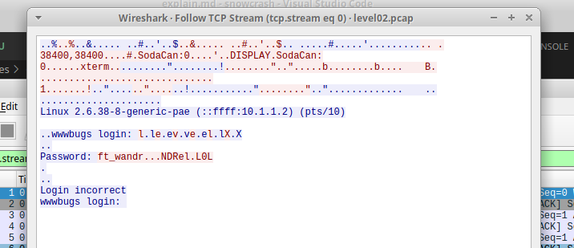

# Level02

Le fichier dans le home est un .pcap, qu'on peut ouvrir avec Wireshark (sur la machine hôte)

```bash
level02@SnowCrash:~$ ls -l
total 12
----r--r-- 1 flag02 level02 8302 Aug 30  2015 level02.pcap
```

Après un SCP sur la machine hote,
Dans Wireshark, aller dans Analyse > Follow > TCP Stream



On remarque un mot de passe `ft_wandr...NDRel.L0L`
contenant des caractères binaire, wireshark nous indiquent des bytes '7F' qui correspondent au caractère de délétion.
Ce qui nous donne: `ft_waNDReL0L`

```bash
flag02@SnowCrash:~$ getflag
Check flag.Here is your token : XXXXXXXXXXXXXXXXXXXXXXXXX
```