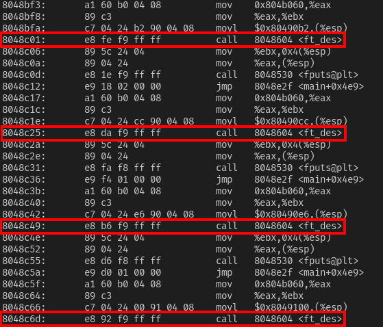

# Level14

Rien dans le dossier home:

```
level14@SnowCrash:~$ ls -la
total 12
dr-x------ 1 level14 level14  100 Mar  5  2016 .
d--x--x--x 1 root    users    340 Aug 30  2015 ..
-r-x------ 1 level14 level14  220 Apr  3  2012 .bash_logout
-r-x------ 1 level14 level14 3518 Aug 30  2015 .bashrc
-r-x------ 1 level14 level14  675 Apr  3  2012 .profile
```

Ni dans les mails.

Tentons un simple getflag

```bash
level14@SnowCrash:~$ getflag
Check flag.Here is your token : 
Nope there is no token here for you sorry. Try again :)
```

Nous avons cherché partout, la seule information qui ai retenu notre interet fût ces étranges strings dans le binaire getflag. 

```
level14@SnowCrash:~$ strings /bin/getflag
...
I`fA>_88eEd:=`85h0D8HE>,D
7`4Ci4=^d=J,?>i;6,7d416,7
<>B16\AD<C6,G_<1>^7ci>l4B
B8b:6,3fj7:,;bh>D@>8i:6@D
?4d@:,C>8C60G>8:h:Gb4?l,A
G8H.6,=4k5J0<cd/D@>>B:>:4
H8B8h_20B4J43><8>\ED<;j@3
78H:J4<4<9i_I4k0J^5>B1j`9
bci`mC{)jxkn<"uD~6%g7FK`7
Dc6m~;}f8Cj#xFkel;#&ycfbK
74H9D^3ed7k05445J0E4e;Da4
70hCi,E44Df[A4B/J@3f<=:`D
8_Dw"4#?+3i]q&;p6 gtw88EC
boe]!ai0FB@.:|L6l@A?>qJ}I
g <t61:|4_|!@IF.-62FH&G~DCK/Ekrvvdwz?v|
...
```
Nous constatons 15 chaines de caractère suspectes, apparement cryptées et de la même taille que les flags. Sauf pour le dernier.

En effectuant un désassamblage du binaire getflag nous remarquons une série de conditions l'une à la suite des autres, faisant toutes appel à une fonction `ft_des` prenant en argument chacunes de ces chaines individuellement. 



La fonction `ft_des` pourrait donc permettre la désencryption de ces chaines de caractère cryptées.

Une idée serait alors de fournir la dernière de la liste pour obtenir le flag 14.

Pour procéder nous utiliserons gdb pour lancer le programme en mode debug et lancer les fonctions souhaitées de manière arbitraire:

Nous mettons un breakpoint à la fonction main.

Nous lançons le programme puis regardons la sortie de la fonction ft_des pour la dernière clé dans le binaire

```bash
(gdb) b main
Breakpoint 1 at 0x804894a
(gdb) r
Starting program: /bin/getflag 

Breakpoint 1, 0x0804894a in main ()
(gdb) p (char*)ft_des("g <t61:|4_|!@IF.-62FH&G~DCK/Ekrvvdwz?v|")
$1 = 0x804c038 "XXXXXXXXXXXXXXXXXXXXXXXXXXXXXXXXXXXXXXX"
```

Le flag final est donc `XXXXXXXXXXXXXXXXXXXXXXXXXXXXXXXXXXXXXXX`